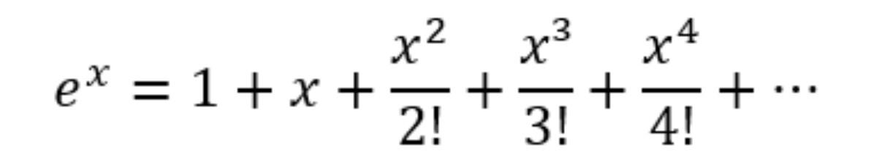

# Exercises

1. Write a program that displays the numbers 1 through 10 using a while loop.
2. Write a program that displays the numbers 1 through 10 using a for loop.
3. Write a program that displays all numbers from 1 to 100, using a while loop. 
4. Write a program that displays all numbers from 1 to 100, using a for loop.
5. Write a program that displays all numbers from 1 to 100, using a do-while loop.
6. Write a program that prints all even numbers from 1 to 100 using a while loop and an if statement inside the loop to check if the number is even or not.
7. Write a program that prints all even numbers from 1 to 100 using a while loop without using any if statement.
8. Write a program that displays even numbers 1 to 50 and odd numbers 51 to 100 using a repeating loop.
9. Create a program that prompts the user for a number and displays the table of that number using a loop.
10. Create a program that displays the table of all numbers from 1 to 10.
11. Write a program that calculates and displays the value of the power of a number entered by the user raised to an exponent also entered by the user, using repetition loops.
12. Create a program that displays the first N first perfect squares, where N is informed by the user, using a loop.
13. Write a program that asks the user for a number N and says whether it is prime or not.
> Prime numbers are natural numbers that are divisible by only 1 and the number itself. In other words, prime numbers are positive integers greater than 1 with exactly two factors, 1 and the number itself. Some of the prime numbers include 2, 3, 5, 7, 11, 13, etc. Always remember that 1 is neither prime nor composite.
14. Write a program that prompts the user for a number N and displays all prime numbers less than N.
15. Create a program that displays the first N prime numbers, where N is informed by the user, using a loop.
16. Write a program that prompts the user for two numbers A and B and displays all numbers between A and B.
17. ​​Write a program that reads numbers from the user until a negative number is entered, and prints the sum of the positive numbers.
18. Write a program that asks the user for a number N and displays the sum of all numbers from 1 to N.
19. Write a program that calculates and displays the sum of even numbers from 1 to 100 using a repeating loop.
20. Write a program that prompts the user for a number and displays the Fibonacci sequence up to the given number using a repeating loop.
21. Write a program that reads numbers from the user until zero is entered, and displays the average of the numbers entered.
22. Write a program that prompts the user for a list of numbers, until the user types the number zero, and displays the largest and smallest numbers in the list.
23. Write a program that prompts the user for a number and displays its divisors.
24.  Write a program that determines the greatest common divisor (GCD) between two numbers entered by the user.
25. Write a program that determines the lowest common multiple (LCM) between two numbers entered by the user.
26. Write a program that calculates the series below up to the tenth element:

27. Rewrite the previous exercise code until the difference between the terms is less than 0.001.
28. Make a program that calculates the value of sine using the Taylor series according to the equation below until the difference between the terms is less than 0.001.

29. Make a program that calculates the value of cosine using the Taylor series according to the equation below until the difference between the terms is less than 0.001.

30. Write a program that displays the sine and cosine value of all numbers from 0 to 6.3, with a step of 0.1, using Taylor series to calculate the respective sines and cosines.
31. 
